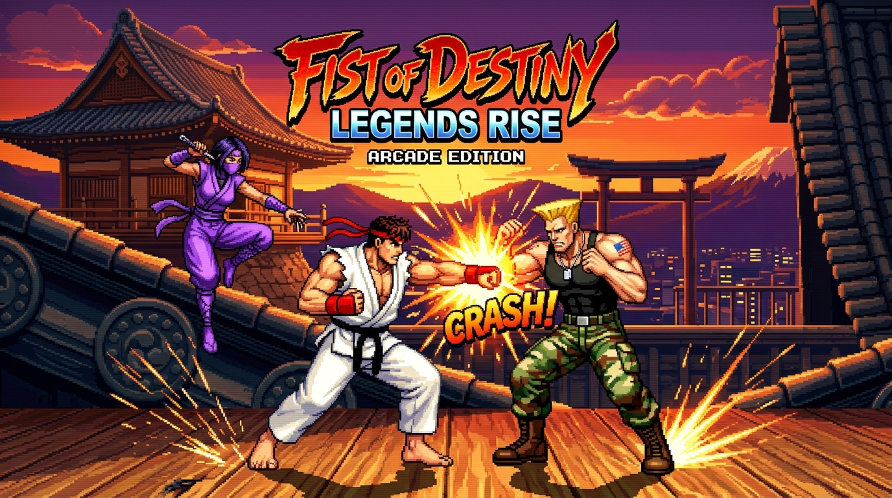

# Final Impact - 16-Bit Pixel Art Fighting Game



**Final Impact** is an authentic 16-bit retro arcade fighting game built completely in pure JavaScript, HTML5 Canvas, and Web Audio API with zero external dependencies.

Featuring smooth frame-based animation, responsive attack cancel combos, impact micro-hitstop, double-tap dashing, cinematic Naruto-style Secret Technique (Ougi) Ultimates, an in-game settings suite, and full 2-Player local vs. / CPU support.

---

## 🎮 Playable Fighters

| Fighter | Archetype | Signature Specials & Ultimate |
| :--- | :--- | :--- |
| **Kazuki (龍神 一輝)** | Balanced Karate Rushdown | **Fire Dragon Fist** (Hadouken), **Rising Dragon Uppercut** (Shoryuken), **Hurricane Kick** (Tatsumaki).<br>**Ultimate:** *Ryujin Gotenha (奥義・龍神轟天破)* - Ki-gathering supersonic dash into explosive rising dragon detonation. |
| **Raven (レイヴン)** | High-Mobility Cyber-Mercenary | **Sonic Blade** (Sonic Boom), **Apex Flash Kick** (Somersault anti-air), **Blitz Knuckle** (Dash punch).<br>**Ultimate:** *Tactical Overdrive: Apex Strike (超戦術・雷光撃)* - Afterimage stealth blitz with multi-hit hyper barrage. |
| **Kagura (神楽 蓮)** | Swift Kunoichi Infiltrator | **Shadow Warp Teleport**, **Spiral Gale Spin Kick**, **Ki Kunai Shuriken Shot**.<br>**Ultimate:** *Secret Technique: Lotus Clones (秘術・千夜蓮華)* - Shadow clone multi-angle assault leaving opponent airborne. |

---

## 🕹️ Controls

### Keyboard Controls

| Action | Player 1 | Player 2 (Local Versus) |
| :--- | :--- | :--- |
| **Move Left / Right** | `A` / `D` | `←` / `→` |
| **Jump** | `W` | `↑` |
| **Crouch** | `S` | `↓` |
| **Dash (Forward / Back)** | Double-tap `A` / `D` | Double-tap `←` / `→` |
| **Light Punch (LP)** | `U` | NumPad `4` |
| **Heavy Punch (HP)** | `I` | NumPad `5` |
| **Light Kick (LK)** | `J` | NumPad `1` |
| **Heavy Kick (HK)** | `K` | NumPad `2` |
| **Special 1 (Projectile / Warp)** | `Q` | NumPad `7` |
| **Special 2 (Anti-Air Uppercut)** | `E` | NumPad `8` |
| **Special 3 (Rush / Spin)** | `R` | NumPad `9` |
| **🔥 ULTIMATE JUTSU (Ougi)** | `SPACE` (Requires 100% Super) | NumPad `0` (Requires 100% Super) |

*Also supports standard USB/Bluetooth Gamepads (Xbox, PlayStation, etc.) automatically.*

---

## ✨ Features & Mechanics

- **Fluid Combat System**: Frame-accurate hitboxes, hurtboxes, pushboxes, blockstun, hitstun, and chip damage.
- **Normal-to-Special Cancels**: Chain light and heavy normals directly into special moves on hit.
- **Impact Crunch (Hitstop)**: Micro-freeze frame effects upon heavy impacts and knockdown strikes.
- **Naruto-Style Secret Techniques (奥義)**: Fill your Super Meter to 100% and unleash dramatic cinematic Ultimates with camera zooms, screen tinting, Japanese kanji banners, and sound effects.
- **Dynamic 16-Bit Sound & Music**: Fully procedural Web Audio retro synthesizer (chiptune synth-bass, kick, snare, hit sounds, voice announcer, and special move audio) - zero external audio assets required.
- **Settings Modal**: Accessible anytime via the top-right button or pressing `Esc` / `P`. Adjust Master, SFX, and Music volume independently, toggle CRT scanlines, game speed, and combat camera shake.

---

## 🚀 How to Run Locally

You can run Final Impact with any static web server:

### Option 1: Built-in Node Server (Zero Dependencies)
```bash
node server.js
```
Then open [http://localhost:3000](http://localhost:3000) in your browser.

### Option 2: Python HTTP Server
```bash
python3 -m http.server 3000
```

### Option 3: Direct Browser Access
Because Final Impact uses standard ES Modules (`import`/`export`), it is recommended to run via a local server (Option 1 or 2) or serve from GitHub Pages.

---

## 🌐 Deploy to GitHub Pages

1. Go to your repository settings on GitHub.
2. Under **Pages**, select **Deploy from a branch**.
3. Choose branch `main` and root directory `/`.
4. Click **Save**. Your game will be live for everyone to play!

---

*Final Impact — Master your timing, chain your combos, and achieve Victory!*
