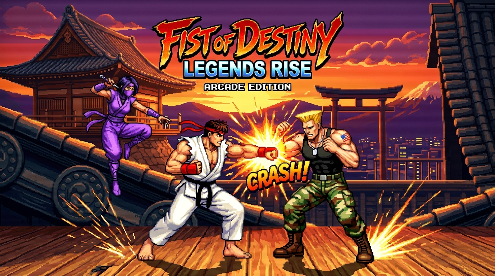

# Final Impact - 16-Bit Pixel Art Fighting Game
### *Mortal Kombat × Elden Ring Arcade Edition*



**Final Impact** is a high-octane 16-bit retro arcade fighting game built entirely in pure vanilla JavaScript, HTML5 Canvas, and Web Audio API with **zero external dependencies**.

Combining the brutal combat flow and finishing moves of **Mortal Kombat**, the stance-break tension and epic boss atmosphere of **Elden Ring**, and fluid cancel-driven fighting mechanics, Final Impact delivers a full arcade experience directly in the browser or on Steam.

---

## 🌟 What's New in the Overhaul

### 💀 Mortal Kombat Finishers & Arcade Towers
* **Cinematic Fatalities & Brutalities**: Finish staggered opponents during the iconic **"FINISH HIM / FINISH HER"** sequence. Features dynamic letterbox bars, camera zooms, slow-motion impacts, and blood-red gothic victory banners.
  * **Kazuki**: *Dragon Cremation* (Incinerating dragon flame pillar).
  * **Raven**: *Orbital Annihilation* (Tactical laser strike from low-orbit satellite).
  * **Kagura**: *Shadow Decapitation* (Sub-zero phantom assassination).
  * **M1GHTY**: *Void Singularity* (Cosmic gravitational tear collapsing foe into oblivion).
* **Stage Fatalities**: Knock foes into deadly hazards (*Industrial Crusher*, *Abyssal Pit*, etc.).
* **Digitized Arcade Announcer**: Authentic retro speech synthesis announcing *"Round 1... FIGHT!"*, *"Finish Him!"*, *"FATALITY"*, *"BRUTALITY"*, and *"FLAWLESS VICTORY"*.

### ⚔️ Elden Ring Combat & Progression
* **Stance / Poise Break & Critical Ripostes**: Every strike chips away at the enemy's hidden Poise bar. Depleting poise triggers a glass-shattering stance break sound, staggered animation, golden rune sparks, and a critical riposte window dealing **2.5× bonus damage**.
* **"YOU DIED" Sequence**: Cinematic slow-fade desaturation and crimson death calligraphy upon defeat.
* **Grand Felled Banners**:
  * **GREAT ENEMY FELLED** (Mid-tier campaign bosses)
  * **LEGEND FELLED** (Tournament Champions)
  * **G O D   S L A I N** (Defeating the Primeval Endless Dragon)
* **Sites of Grace**: Intermission resting checkpoints between campaign battles that refill Crimson Flask charges and save tournament progress.

### 🛍️ Item Shop & Cosmetic Customization
* **18+ Fighter Skins**: Unlock Rare, Epic, and Legendary skins with earned tournament fight coins.
* **Energy Aura Trails**: Equip custom particle auras (*Dragon Flame*, *Neon Overcharge*, *Void Shadows*, *Super Saiyan Ki*, *Glacial Blizzard*).
* **Impact Hit Sparks**: Customize strike hitsparks (*Arcade Retro*, *Mortal Bloodburst*, *Volt Jolt*, *Elden Runes*).
* **Fighter Titles**: Showcase prestigious titles (*The Tarnished*, *Arcade Grandmaster*, *Lord of Frenzied Flame*, *Dragon Slayer*).

---

## 🎮 Game Modes

| Mode | Type | Description |
| :--- | :--- | :--- |
| **🏆 Campaign** | Story / Boss Rush | Battle through 7 scaling underground crime bosses leading to the 2-Phase Elden Ring Primeval Apex & Endless Dragon. |
| **🤝 Co-Op Campaign** | Online 2P Raid | Team up with a friend online to conquer all 8 campaign bosses together in simultaneous 2v1 and 2v2 boss battles. |
| **⚔️ 1v1 vs CPU** | Single Match | Quick arcade exhibition against tactical AI with customizable difficulty and reaction speeds. |
| **🥊 1v1 vs Friend** | Local Couch 2P | Head-to-head local battle sharing one keyboard or dual gamepads. |
| **🔥 2v2 Team Brawl** | 4-Fighter Tag War | Two teams of two battle simultaneously on-screen with cel-shaded rim lighting and team pushboxes. |
| **🌐 Online Versus** | WebRTC Netplay | Direct peer-to-peer online multiplayer with room codes and instant invite links. |
| **🥋 Practice Dojo** | Combo Lab | Unlimited health and super meter with frame data display to lab out cancel strings and juggles. |
| **🛍️ Item Shop** | Cosmetics | Browse, preview on live animated 3D models, and equip custom skins, auras, hit sparks, and titles. |

---

## 🥋 Playable Fighters

| Fighter | Archetype / Origin | Signature Specials & Ultimate |
| :--- | :--- | :--- |
| **Kazuki (龍神 一輝)** | Karate Rushdown (Japan) | **Hadouken** (Ki Fireball), **Shoryuken** (Rising Uppercut), **Tatsumaki** (Spinning Kick).<br>**Ultimate:** *Ryujin Gotenha (奥義・龍神轟天破)*<br>**Fatality:** *Dragon Cremation* |
| **Raven (レイヴン)** | Tactical Commando (USA) | **Sonic Blade** (Sonic Razor), **Flash Somersault** (Anti-air kick), **Blitz Knuckle** (Dash punch).<br>**Ultimate:** *Tactical Overdrive (超戦術・雷光撃)*<br>**Fatality:** *Orbital Annihilation* |
| **Kagura (神楽 蓮)** | Cyber Kunoichi (Neo Tokyo) | **Shadow Warp** (Teleport), **Crescent Gale** (Wind kick), **Ki Kunai** (Shuriken volley).<br>**Ultimate:** *Lotus Clones (秘術・千夜蓮華)*<br>**Fatality:** *Shadow Decapitation* |
| **Fang** | Muay Thai / Lethwei (Thailand) | **Tiger Knee** (Leaping knee), **Cyclone Elbow** (Spinning slash), **Iron Teep** (Pushback kick). |
| **Zephyr** | Capoeira Acrobat (Brazil) | **Windmill Kick** (Ground sweep), **Handstand Axe** (Heel drop), **Flare Slide** (Low slide). |
| **Colossus** | Heavyweight Boxer (USA) | **Dempsey Blow** (Armored hook), **Corkscrew** (Spiral uppercut), **Gazelle Punch** (Leaping lead). |
| **Cinder** | Flame Shinobi (Ash Province) | **Flame Warp**, **Ember Gale**, **Fire Kunai**. |
| **Glacier** | Frostbound Assassin (Frozen North)| **Ice Shard**, **Frost Rise**, **Blizzard Kick**. |
| **Oracle** | Astral Sorceress (Ruins) | **Star Step**, **Comet Fall**, **Astral Dart**. |
| **Bandit** | Road Reaver (Wastelands) | **Razor Toss**, **Back Flip Slash**, **Knuckle Dust**. |
| **Ronin** | Crimson Blade (Feudal Japan) | **Wave Cutter**, **Rising Katana**, **Whirl Kick**. |
| **Vagabond** | Wandering Knight (Fallen Kingdom)| **Edge Wave**, **Knight Flip**, **Shield Ram**. |
| **Warden** | Wall of the Desert (Sand Citadel) | **Citadel Knee**, **Twin Blades**, **Iron Gate**. |
| **M1GHTY** *(Classified)* | Divine Annihilator (Astral Realm) | **One-Hit Extinction Combat Arts**.<br>**Ultimate:** *Grand Celestial Ruin*<br>**Fatality:** *Void Singularity* |

---

## ⛩️ Battle Arenas

Select from 6 distinct stages featuring animated parallax backgrounds and dynamic lighting:
1. **Suzaku Rooftop** (Tokyo Sunset cherry blossoms and blood-red skyline)
2. **Neo Underpass** (Cyberpunk rain, steam vents, and neon bullet train)
3. **Thunder Dojo** (Ancient storm hall with flashes through shoji screens)
4. **Dragon Shrine** (Rune-lit pillars under a violet moon)
5. **Ember Forge** (Volcanic foundry roaring with molten rivers)
6. **Moonlit Bamboo** (Midnight mist grove with glowing fireflies)

---

## 🕹️ Controls

### Keyboard Controls

| Action | Player 1 | Player 2 (Local Versus) |
| :--- | :--- | :--- |
| **Move Left / Right** | `A` / `D` | `←` / `→` |
| **Jump** | `W` | `↑` |
| **Crouch** | `S` | `↓` |
| **Dash (Forward / Back)** | Double-tap `A` / `D` | Double-tap `←` / `→` |
| **Light Punch (LP)** | `U` | NumPad `4` |
| **Heavy Punch (HP)** | `I` | NumPad `5` |
| **Light Kick (LK)** | `J` | NumPad `1` |
| **Heavy Kick (HK)** | `K` | NumPad `2` |
| **Special 1 (Projectile / Warp)** | `Q` | NumPad `7` |
| **Special 2 (Anti-Air Uppercut)** | `E` | NumPad `8` |
| **Special 3 (Rush / Spin)** | `R` | NumPad `9` |
| **🔥 ULTIMATE JUTSU (Ougi)** | `SPACE` (Requires 100% Super) | NumPad `0` (Requires 100% Super) |
| **💀 FATALITY (Finish Him Window)**| `SPACE` or `I + K` | NumPad `0` or `NumPad 5 + 2` |
| **⚡ STAGE FATALITY** | `C` | NumPad `3` |
| **🔒 Secret Developer Portal** | `Ctrl + Shift + Alt + A` | — |

---

### 🎮 Gamepad / Controller Layout (Xbox / PlayStation / Switch)

| Action | Xbox | PlayStation | Switch Pro |
| :--- | :--- | :--- | :--- |
| **Move / Jump / Crouch** | Left Stick / D-Pad | Left Stick / D-Pad | Left Stick / D-Pad |
| **Dash (Fwd / Back)** | Double-tap Stick / D-Pad | Double-tap Stick / D-Pad | Double-tap Stick / D-Pad |
| **Light Punch (LP)** | `X` | `Square (▢)` | `Y` |
| **Heavy Punch (HP)** | `Y` | `Triangle (△)` | `X` |
| **Light Kick (LK) / Confirm** | `A` | `Cross (✕)` | `B` |
| **Heavy Kick (HK) / Back** | `B` | `Circle (◯)` | `A` |
| **Special 1 (Fireball / Warp)** | `RB` | `R1` | `R` |
| **Special 2 (Uppercut / Spiral)** | `RT` | `R2` | `ZR` |
| **Special 3 (Spin / Hurricane)** | `LB` | `L1` | `L` |
| **Dirty Tactic (Desperation)** | `LT` | `L2` | `ZL` |
| **🔥 ULTIMATE / FATALITY** | `R3` (Stick Click) / `LB+RB` | `R3` / `L1+R1` | `R3` / `L+R` |
| **Pause / Arcade Settings** | `Start` | `Options` | `+` |

*Hot-plugging is fully supported — connect up to 2 controllers for seamless couch multiplayer.*
### 🏆 Steam Achievements & In-Game Toasts
* **11 Core Achievements**: Unlocked dynamically in combat (*First Impact*, *Shattered Poise*, *Tarnished Riposte*, *Secret Ougi*, *Flawless Execution*, *Untouchable*, *Drip Legend*, *High Roller*, *God Slain*, *Void Ascension*, and *Street Grandmaster*).
* **Sliding Golden Trophy Toasts**: Steam-style carbon and gold toast popups slide smoothly into view upon unlocking an achievement with retro chime fanfare.
* **Persistent Progress**: Unlocked achievements save permanently to local storage.

### 🎭 Campaign Pre-Fight Dialogue & Story Banter
* **Retro Arcade Cutscenes**: Authentic comic dialogue boxes with speaker avatars and themed nameplates appear before each of the 8 boss encounters.
* **Full Cast of 8 Bosses**: Banter against *Sgt. Vance*, *The Promoter*, *Boris & Viktor*, *The Matriarch*, *Street Lord*, *Urban Legend*, *Rex Gannon*, and the primordial *Endless Dragon*.
* **Combat Juice Overhaul**: Dynamic camera zoom ($1.25\times$) during Poise Breaks and Naruto Ultimates, tuned hit-stops (4–8 frames), and screen shake.

---

## 🖥️ Standalone PC Desktop App (Steam Release)

Final Impact runs natively as a desktop application using the included Electron shell:
```bash
npm run electron:start
```
* **Hardware Acceleration**: Full 60 FPS performance with zero browser chrome or address bars.
* **Controller Support**: Native XInput and DirectInput plug-and-play detection.
* **Fullscreen Hotkey**: Press <kbd>F11</kbd> anytime to toggle seamless borderless fullscreen.

---

## 🛠️ Build Pipeline & Creator Tools

Final Impact features an automated multi-target build pipeline (`scripts/build.mjs`):

* **Public Retail Build** (`npm run build`):
  * Generates optimized production bundle (`dist/game.bundle.js`).
  * Completely strips and stubs all developer/admin console code, passwords, and cheat tools for competitive fairness.
* **Creator Admin Build** (`npm run build:admin`):
  * Injects the private developer console (`src/admin/private/AdminModal.dev.js`, kept in `.gitignore` and never uploaded to GitHub).
  * Grants the creator instant god mode, infinite coins, custom skin unlocking, and debug cheats.

---

## 🚀 Running Locally & Testing

### Option 1: Built-in Node Server (Zero Dependencies)
```bash
node server.js
```
Then open [http://localhost:3000](http://localhost:3000) in your web browser.

### Option 2: Standalone Desktop Mode
```bash
npm run electron:start
```

### Running Automated Test Suites
Final Impact includes 4 automated test suites covering all combat mechanics, gamepad input, item shop, achievements, and dialogue:
```bash
npm test
```
*Executes all 80+ test cases across 4 test suites with 100% pass verification.*

---

## 🌐 Deploying to GitHub Pages

1. Navigate to your repository settings on GitHub.
2. Under **Pages**, select **Deploy from a branch**.
3. Choose branch `main` and root directory `/`.
4. Click **Save** — your game is live and playable worldwide!

---

*Final Impact — Master your spacing, shatter enemy poise, and execute your Destiny!*
